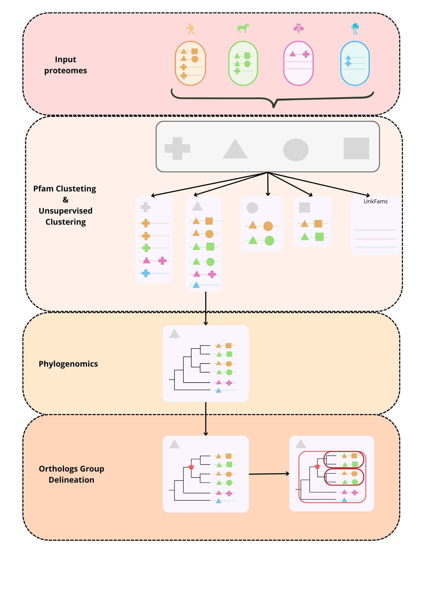

# DOOD: Domain Oriented Orthology Delineation



---

## Overview

**DOOD (Domain Oriented Orthology Delineation)** is a bioinformatics pipeline designed to identify orthologous groups across various proteomes. It leverages a Nextflow framework to automate a multi-step process: initial protein clustering based on Pfam domains, phylogenetic tree building, and a final orthology analysis to define gene duplication events and orthologous groups (OGs).

## Key Features

* **Domain-Based Clustering:** Initial protein clustering groups sequences into Pfam families (PfamFams). Sequences with multiple domains are assigned to all relevant PfamFams.
* **UnkFam Clustering:** Sequences without identifiable Pfam domains are clustered separately using MMseqs2 to form "UnkFams."
* **Automated Gene Tree Building:** For families with at least three sequences, DOOD automatically generates multiple sequence alignments (MSAs), removes uninformative columns from the alignments, and infers a gene tree.
* **Orthology Delineation (OGD):** The pipeline employs the OGD algorithm to analyze each gene tree, detect gene duplication events, and define orthologous groups (OGs) at various taxonomic levels.

---

## Requirements

DOOD uses `Nextflow` as its workflow manager. The pipeline's dependencies are handled by a provided Apptainer image, but you can also install them individually.

### Dependencies for Apptainer image

* **Clustering:** `eggnog-mapper`, `HMMER v 3.1b2`, `MMseqs2`, `BioPython`
* **Phylogenomics:** `Famsa`, `Mafft`, `FastTree`
* **Orthology:** `ETE4`, `FastRoot`

---

## Installation

### 1. With Apptainer (Recommended)

This method simplifies the installation process by providing all dependencies in a single container.

1.  **Install Nextflow:**
    ```bash
    curl -s [https://get.nextflow.io](https://get.nextflow.io) | bash
    chmod +x nextflow
    ```

2.  **Clone the DOOD repository:**
    ```bash
    git clone git@github.com:AnaHrnndz/cpo_nextflow.git
    cd cpo_nextflow
    ```

3.  **Download the DOOD Apptainer image:**
    Download the image (`dood_img.sif`) from the following link and place it in a designated directory (e.g., `apptainer/`).
    `https://saco.csic.es/s/eQWa5qsGRW2EqxF`

4.  **Download and set up data:**
    Download the necessary data folder from the link below. Place this `data` folder in the same directory as your `DOOD.nf` script.
    `https://saco.csic.es/s/xjzGL86Cj2x2WJs`

    Your project structure should look like this:
    ```
    cpo_nextflow/
        ├── DOOD.nf
        ├── bin/
        └── data/
            ├── pfam/
            ├── ete_taxonomy/
            └── proteomes.fasta
    ```

5.  **Try the example run:**
    ```bash
    bash ./nextflow run DOOD.nf -with-apptainer apptainer/dood_img.sif -c local.config -with-trace -resume
    ```

---

### 2. Manual Installation

If you prefer to install all dependencies manually, you can use Conda and Pip.

1.  **Create a Conda environment and clone the repository:**
    ```bash
    conda create -n dood_env python=3.10
    conda activate dood_env
    git clone git@github.com:AnaHrnndz/cpo_nextflow.git
    ```

2.  **Install Python libraries:**
    ```bash
    pip install BioPython FastRoot eggnog-mapper
    pip install --force-reinstall [https://github.com/etetoolkit/ete/archive/ete4.zip](https://github.com/etetoolkit/ete/archive/ete4.zip)
    ```

3.  **Install other tools:**
    Download and set up `MMseqs2`, `FAMSA`, and `FastTree` by following the links in the **Requirements** section.

---

## Input Files

DOOD requires a FASTA file and other optional data files.

* **Proteome FASTA file:** A single FASTA file containing all proteome sequences.
    * **Sequence Naming Convention:** Sequence headers must follow the format `ncbi_taxid.sequence_name` (e.g., `9606.NP_000001.1`). The species delimiter can be changed in the config file.

* **Optional Input Files:**
    * **Pfam database:** The pipeline is pre-configured to use Pfam v35. You can replace the files in `data/pfam/` if you wish to use a different version.
    * **NCBI taxonomy database:** A specific version of the NCBI taxonomy database is provided in `data/ete_taxonomy/`. You can replace this if needed.

---

## Output

DOOD generates three main output directories, corresponding to each stage of the pipeline.

* **`Clustering/`**: Contains all output from the initial clustering steps.
    * `fasta/`: Raw FASTA files for each family.
    * `result_hmm_mapper.emapper.hmm_hits`: Main output file from the Pfam clustering.

* **`Phylogenomics/`**: Contains files generated during the tree-building phase.
    * `aln/`: All alignments.
    * `trim_aln/`: Trimmed alignments.
    * `trees/`: Inferred phylogenetic trees.

* **`Orthology/`**: Contains a subfolder for each family, with the following key outputs from the OGD algorithm.
    * `*.tree_annot.nw`: Newick file with annotated trees.
    * `*.ogs_info.tsv`: Tab-separated file with orthologous group information.

---

## How to Run DOOD

### Local Execution

* **To run the entire pipeline with Apptainer:**
    ```bash
    bash /path/to/nextflow run DOOD.nf -with-apptainer apptainer/dood_img.sif -c local.config -with-trace -resume
    ```
    * Replace `/path/to/nextflow` with the actual path to your Nextflow executable.

* **To re-run specific processes (e.g., OGD):**
    You can use the `-until` option to resume a pipeline from a specific point.
    ```bash
    bash /path/to/nextflow run DOOD.nf -c new_local.config -with-trace -resume -until ogd_pfam,ogd_mmseqs
    ```

* **To run specific modules/subworkflows:**
    You can execute individual subworkflows by specifying the entry point.
    ```bash
    bash /path/to/nextflow run subworkflows/phylogenomics.nf -c local.config -resume -entry MODULE_PHYLOGENOMICS
    bash /path/to/nextflow run subworkflows/orthology.nf -c local.config -resume -entry MODULE_ORTHOLOGY
    ```

### HPC Execution

To submit DOOD to an HPC cluster (e.g., with Slurm), you would typically use a submission script.

```bash
sbatch run_cpo_pipeline.sh cpo_nextflow/DOOD.nf slurm.config
```


## DOOD Pipeline Parameters

* This file contains the key parameters for running the pipeline.
* You can adjust these values to suit your working environment.

```
// --- File and Directory Paths ---
//
// Full paths to input, output, and reference data.

params {
    // Path to the input FASTA file
    input = "/data/projects/cpo_pipeline/data/Dickeya.fa"

    // Directory where all results will be saved
    general_output = "/data/projects/test_cpo_local"

    // Path to the main data directory
    pfam_db = "/data/projects/cpo_pipeline/datas/pfam/Pfam-A.hmm"
    pfam_datadir = "/data/projects/cpo_pipeline/datas"
    ogd_taxonomy_db = "/data/projects/cpo_pipeline/datas/ete_taxonomy/e6.taxa.sqlite"
}

// --- Tool Parameters ---
//
// Configuration for resources and options of bioinformatics tools.

params {
    // HMMER parameters
    // Note: num_server * num_workers should equal cpu.
    hmmer_num_servers = 2
    hmmer_num_workers = 5
    hmmer_cpu = 10

    // FAMSA parameters
    famsa_threads = 1

    // MMseqs2 de novo clustering parameters
    mmseqs_threads = 2
    mmseqs_coverage = 0.3
    mmseqs_min_seq_id = 0.3
    sensitivity = 7
    cov_mode = 2
    cluster_mode = 0

    // OGD parameters
    ogd_rooting = "MinVar"
    ogd_sp_delimitator = "."
    ogd_sp_overlap = 0.1
    ogd_sp_lost = 0.7
}
```